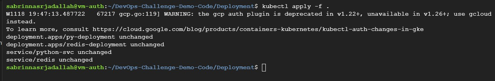

## Notes:
- Deployment exposed to public internet with a public HTTP load balancer.
- The image deployed on GKE come from GCR or Artifacts registry.
- I create a custom SA and attach it to my nodes (I didnt use default compute service account while creating the gke cluster).

##  Setup:
* 1- Use Secret resource to pull image from private container registry 

 
* 2- Apply Deployment files

 
* 3- Get Application External Ip 

 
* 4- Write External ip in any browser

 

