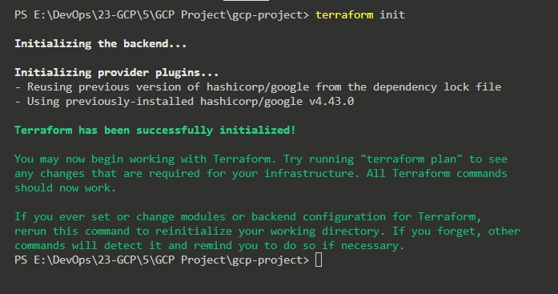
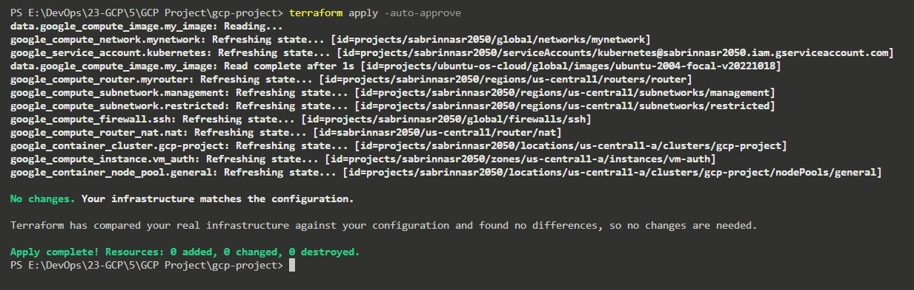
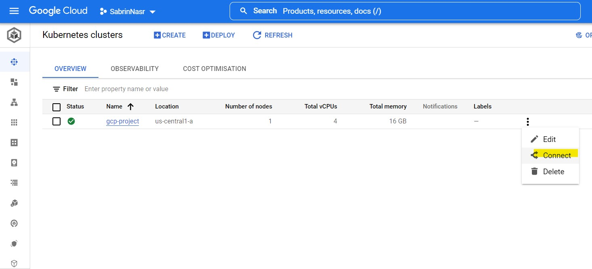

# Terraform Code to Build Infrastructre on GCP ( Google Cloud Platform )
### Network:
* 1 VPC
* 2 subnets (management subnet & restricted subnet):
1. Management subnet has the following:
• NAT gateway
• Private VM
2. Restricted subnet has the following:
• Private standard GKE cluster (private control plan)

### General Notes:
• Restricted subnet didnt have access to internet.
• Only the management subnet can connect to the gke cluster.
• Deployment exposed to public internet with a public HTTP load balancer.
• I create a custom SA and attach it to my nodes (I didnt use default compute service account while creating the gke cluster).

## Command and steps:
* 1- Terraform init 

* 2- Terraform Apply to build Infra :

* 3- SSH into vm and initialize it with [ gcloud , kubectl , service account ]

* 4- Connect to Cluster :

